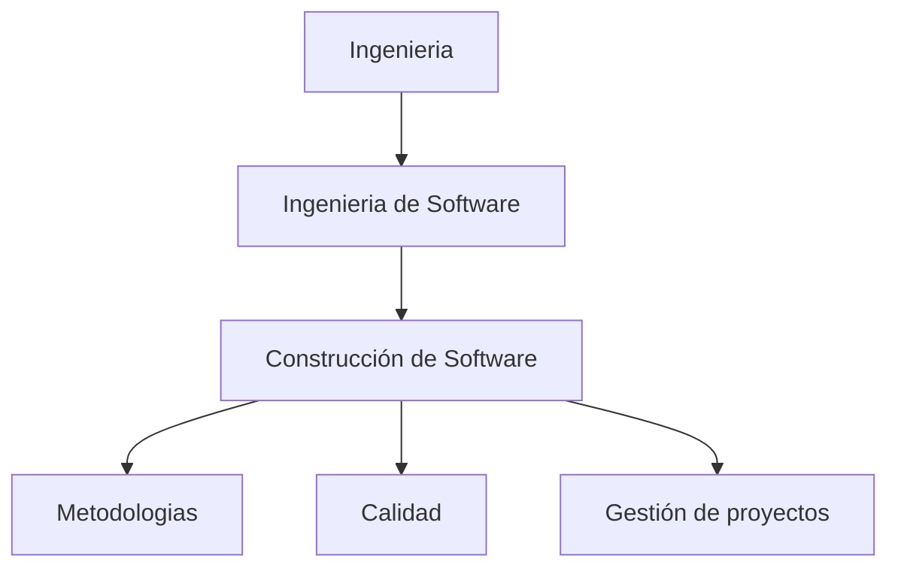

# Gestión de calidad de Software
## Julio 18 del 2022
### Contextualización
#### Objetivo Espacio 1:
- Contextualización
- Presentación del curso
- Actividad Inicial
#### Datos del Docente:
| Docente | Celular |
| :------ | ------: | 
| Wilson Andrés Ramirez R. |  3126023418 |

#### Gráfico 1:

#### Actividad 1
Ver este [video](https://www.youtube.com/watch?v=FAhdlq0Zytk) primero
-----
- Video trata de las metodologías ágiles
- video muestra que no es un silver bullet
- Métodos agiles y Métodos tradicionales son compatibles
- Personas sobre Herramientas
- Pero las herramientas ayuda a tener software de calidad via testing en el periodo de un sprint
- 